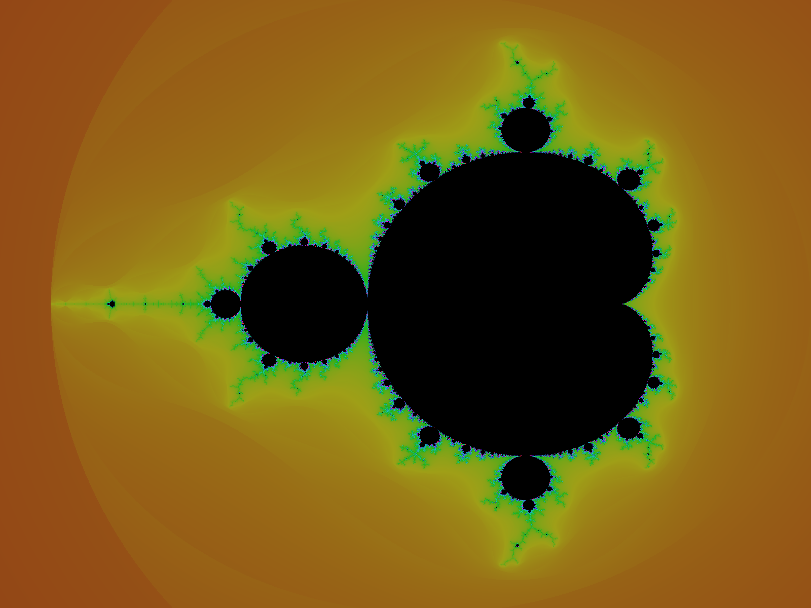
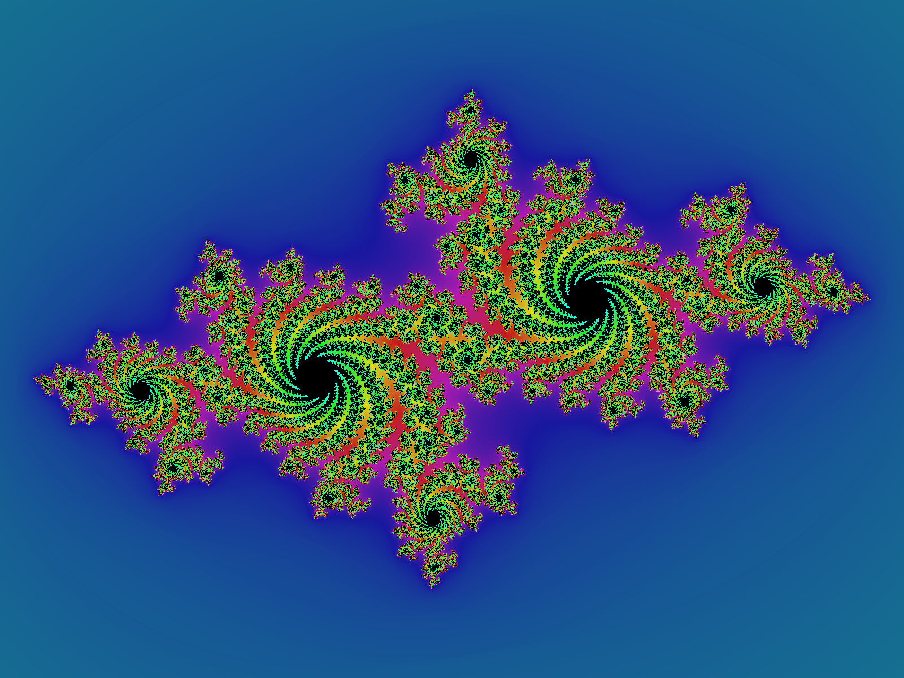
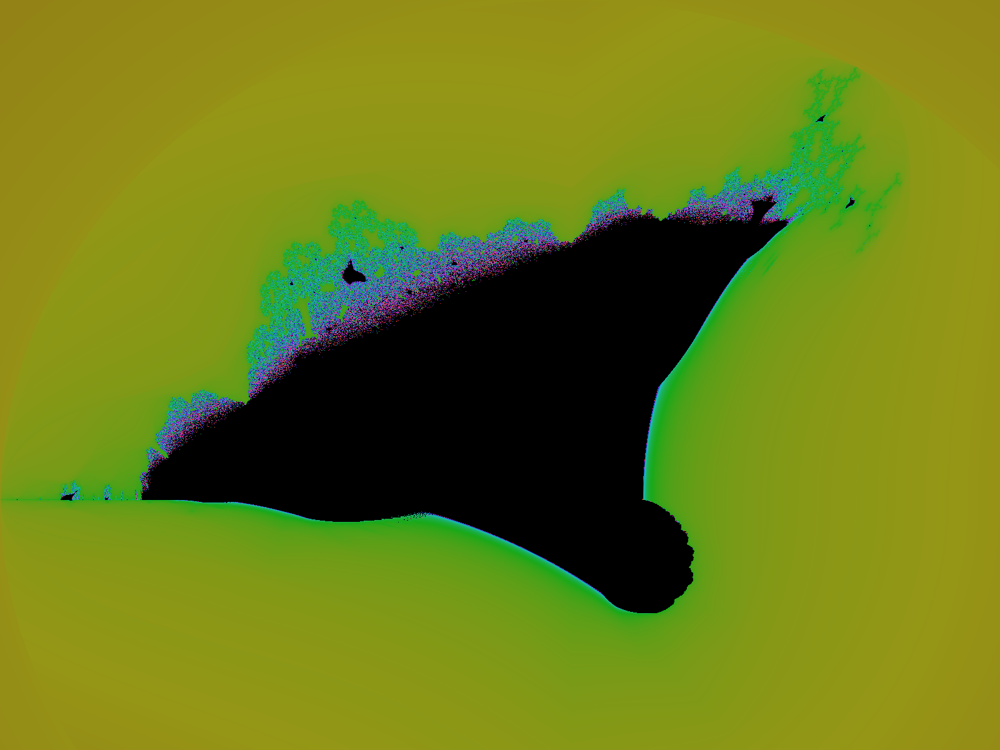
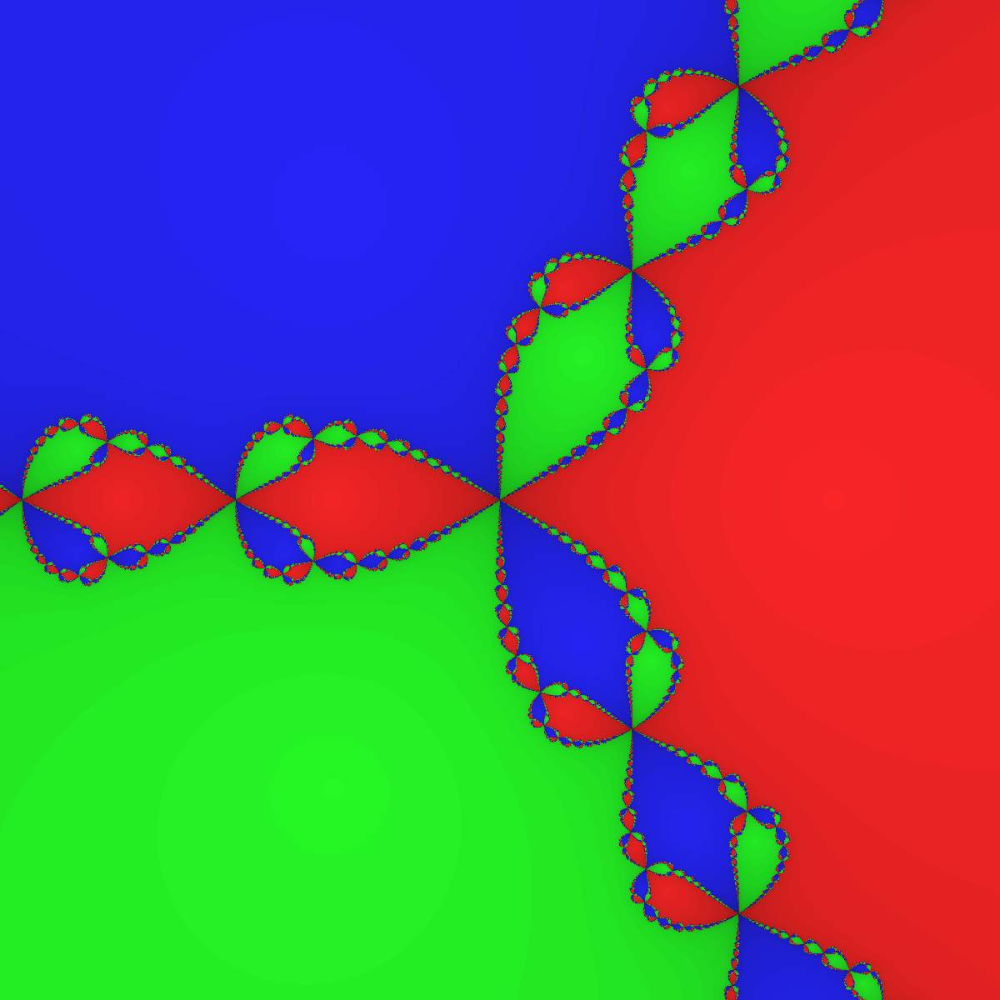
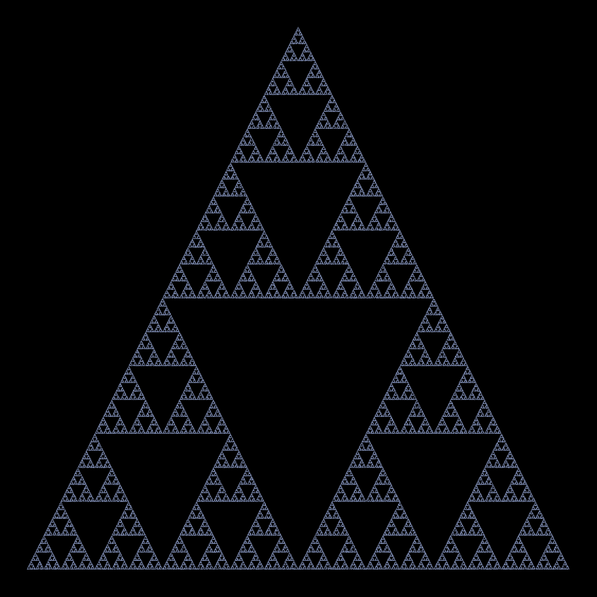
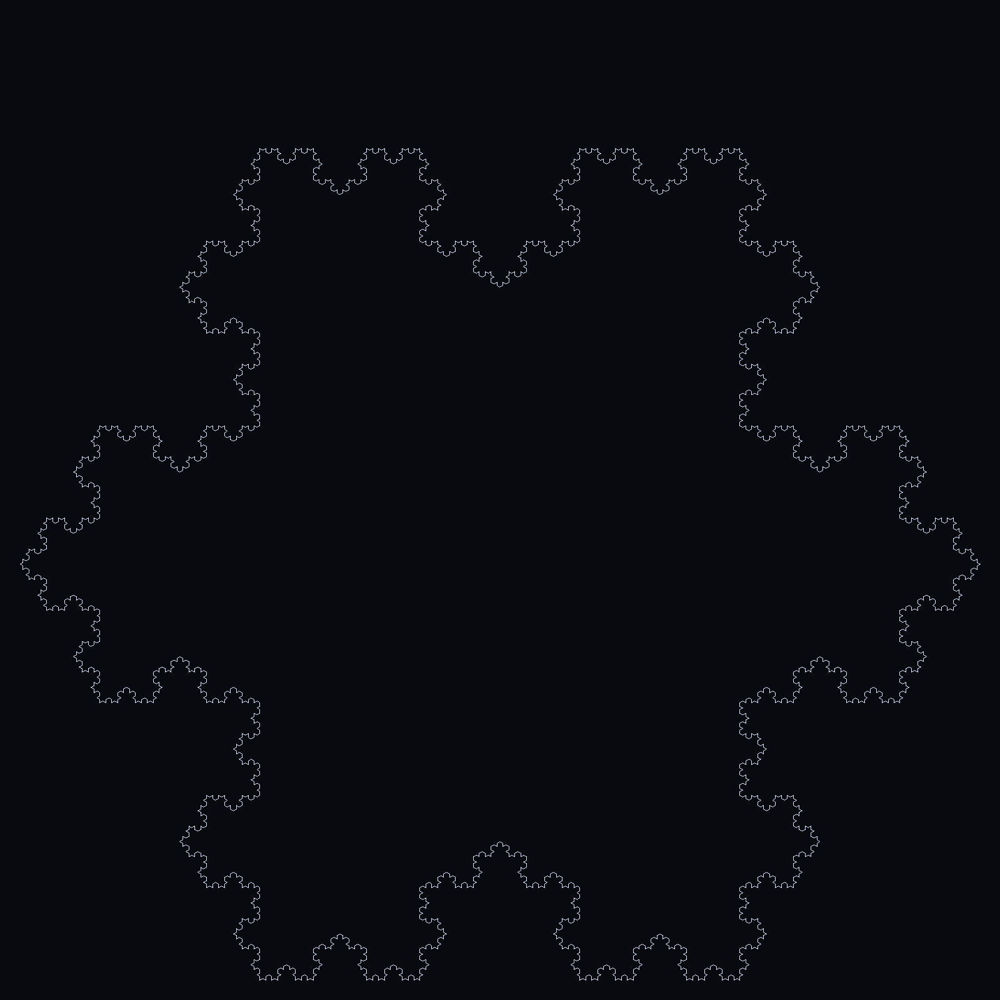
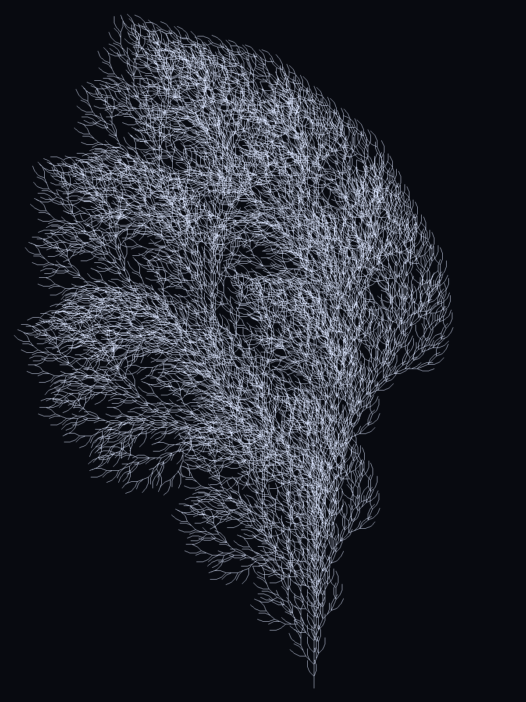

<h1 align="center">Hi, I'm dsculptor 👋</h1>

  CTO at <a href="https://www.toughtongueai.com"><strong>Tough Tongue AI</strong></a>
  &nbsp;·&nbsp;
  Self-hoster · IoT tinkerer · 3D printer · Hacker

  
  &nbsp;
  

---

I build for the long-running self-hosted shop — hardware that hums in a closet,
software that doesn't need babysitting, small tools that compose well.

At [**Tough Tongue AI**](https://www.toughtongueai.com) we're building a platform for
building and orchestrating voice AI agents — multimodal, agentic, white-label ready.
[Try it →](https://www.toughtongueai.com)

| Area               | What I work on                                                           |
|--------------------|--------------------------------------------------------------------------|
| **Voice AI**       | CTO @ [Tough Tongue AI](https://www.toughtongueai.com) — platform for building & orchestrating voice AI agents |
| **Self-hosting**   | Proxmox, NAS, reverse proxies, Tailscale-everything                      |
| **IoT & embedded** | ESP32, MicroPython, sensor meshes that report home                       |
| **3D printing**    | Functional prints first, art second                                      |
| **Full-stack TS**  | Exploring _"all of it in TypeScript"_ — config, scripts, runtime         |
| **Hacking**        | Reverse engineering, weekend protocol spelunking                         |

- 💞 Looking to collaborate on **self-hosted products**.
- 📫 `dsculptor@altmails.com`

---

## I :hearts: Fractals

> *"Clouds are not spheres, mountains are not cones, coastlines are not circles,
> and bark is not smooth, nor does lightning travel in a straight line."*
> — Benoît Mandelbrot, *The Fractal Geometry of Nature* (1982)

  

  
    Every image on this page is rendered by the Python package in this repo.
    A GitHub Action re-runs <code>uv run build-all</code> on every push —
    change a kernel, push, watch the profile redraw itself.
    <a href="#run-it-yourself">Clone & run it →</a>
  

I have a conviction that **great codebases are beautiful fractals**.

A webpage is laid out as cards with rhythm and spacing. Each card is itself a
smaller composition with its own rhythm and spacing. Zoom in further and you
reach glyph rasterization — vectors arranged into letters, the same exercise
repeating at a finer grain. Every level looks like the last, just smaller.

The same self-similarity hides everywhere:

- **APIs** built on top of APIs.
- **Compilers** that bootstrap themselves; new features echo old ones.
- **Linux** — a sprawling fractal of packages assembling smaller packages.
- **Networking** — layering as a textbook self-similar stack.
- **A GET request → motherboard firmware** — bits being munged at every scale.
- **Neural networks** — repeating layers stacked into deeper layers.

> Build software the same way: pick a clean atom, then echo it.

  <a href="#a-short-history">History</a> ·
  <a href="#what-makes-something-a-fractal">Definition</a> ·
  <a href="#three-ways-to-make-a-fractal">Algorithms</a> ·
  <a href="#the-gallery">Gallery</a> ·
  <a href="#where-fractals-show-up-in-the-wild">In the wild</a> ·
  <a href="./fractals/README.md">Source</a>

---

## A short history

Long before they had a name, fractals were lurking on the edges of mainstream
math — uncomfortable curves that respectable mathematicians wished would go away.

| Year | What happened |
|------|---------------|
| **1872** | Weierstrass exhibits a continuous-but-nowhere-differentiable function. Hermite calls such curves a *"dreadful plague."* |
| **1883** | Cantor builds his ternary set — uncountable, totally disconnected, zero length. |
| **1904** | Helge von Koch publishes the snowflake. Infinite perimeter, finite area. |
| **1915** | Sierpiński introduces the triangle and carpet that bear his name. |
| **1918** | Fatou & Julia work out iteration theory of complex rational functions — describing Julia sets without ever drawing one. |
| **1968** | Aristid Lindenmayer, a botanist at Utrecht, invents L-systems to model how plants grow. |
| **1975** | Mandelbrot coins **fractal** (Latin *fractus* — broken). His 1982 book argues nature is fractal by default. |
| **1980** | Mandelbrot publishes the first plot of *the* set — small, monochrome, dotted. Computers had just barely caught up. |
| **1988** | Barnsley shows that a handful of affine maps compress a fern. *Fractals Everywhere* lands. |
| **1991** | Shishikura proves the Mandelbrot boundary has Hausdorff dimension exactly **2** — it fills the plane. |
| **1992** | Michelitsch & Rössler perturb Mandelbrot's iteration with absolute values. The result looks like a ship in flames. |

## What makes something a fractal

Mandelbrot resisted a single definition — fractals are a family, not a club
with a bouncer. But three properties recur:

1. **Self-similarity** — zoom in; the whole pattern reappears at smaller scale.
2. **Detail at every scale** — there is no "smooth enough." Structure persists indefinitely.
3. **Non-integer Hausdorff dimension** — rougher than a line, less filling than a plane.

For a self-similar set of `N` copies each scaled by `1/r`, the dimension is
`log(N) / log(r)`:

| Shape | dim |
|-------|-----|
| Cantor ternary set | log 2 / log 3 ≈ **0.631** |
| Koch snowflake perimeter | log 4 / log 3 ≈ **1.262** |
| Sierpinski triangle | log 3 / log 2 ≈ **1.585** |
| Mandelbrot set boundary | **exactly 2** (Shishikura, 1991) |

Non-integers sitting between integers — and *that* is the whole point.

## Three ways to make a fractal

Almost every famous fractal falls into one of three algorithmic families.
This repo ships one renderer for each.

**1. Escape-time** — iterate `z ← f(z, c)` per pixel; ask how fast `|z|`
runs to infinity. Points that don't escape form the fractal; the rest are
colored by *how fast*. → Mandelbrot, Julia, Burning Ship.

**2. Iterated Function Systems (chaos game)** — pick a weighted affine map
at random, apply it, plot, repeat 10⁵–10⁶ times. The attractor emerges from
the noise as if it were always there. → Sierpinski triangle, Barnsley fern.

**3. L-systems** — start with a string, replace every character by a longer
string, walk the result with a turtle. Born in a botany lab; now powers the
foliage in every video game on Earth. → Koch snowflake, recursive tree.

---

## The gallery

> Click any image for the full-resolution render.

<table>
  <tr>
    <td align="center" width="50%">
      
       <strong>Mandelbrot set</strong> &nbsp;· 1980
       <code>z ← z² + c</code>, starting from z₀ = 0
       boundary dim = <strong>2</strong> (Shishikura, 1991)
        
      The most famous fractal, and one of the youngest. Take every complex c;
      iterate; the points whose orbit stays bounded are the black body. Described
      by Julia & Fatou in 1918 without ever being drawn — only <em>seen</em> by
      Mandelbrot in 1980 when computers had finally caught up.
    </td>
    <td align="center" width="50%">
      
       <strong>Julia set</strong> &nbsp;· 1918
       <code>z ← z² + c</code>, c fixed = −0.7 + 0.27015i
        
      Fix a single c and ask the same question. Every Julia set is one
      vertical slice of the bigger story the Mandelbrot set tells. A Julia set
      is connected iff its c sits <em>inside</em> the Mandelbrot set. Pass any
      seed to <code>uv run fractals julia -c …</code> and watch it morph.
    </td>
  </tr>
  <tr>
    <td align="center">
      
       <strong>Burning Ship</strong> &nbsp;· Michelitsch & Rössler, 1992
       <code>z ← (|Re z| + i·|Im z|)² + c</code>
        
      The Mandelbrot iteration with absolute values slipped in. The map
      is no longer analytic, so smooth bulbs become hard angles, antennas, and
      silhouettes that look like ships ablaze on a sea of plasma.
    </td>
    <td align="center">
      
       <strong>Newton fractal</strong> &nbsp;· z³ − 1
       <code>z ← z − f(z)/f′(z)</code>
        
      Run Newton's method from every pixel; color by which root it
      converges to. The three primary basins are simple — but their boundary
      is fractal. Every two basins meet only where the third also lives.
      Cayley posed this in 1879 and got stuck.
    </td>
  </tr>
  <tr>
    <td align="center">
      
       <strong>Sierpinski triangle</strong> &nbsp;· 1915
       3 half-scale affine maps · dim = log 3 / log 2 ≈ <strong>1.585</strong>
        
      The chaos game in its purest form: pick a vertex of a triangle at
      random, jump halfway towards it, plot the point, repeat. After 300k
      jumps the Sierpinski triangle emerges from the noise as if it were
      always there.
    </td>
    <td align="center">
      
       <strong>Barnsley fern</strong> &nbsp;· 1988
       4 affine maps · weights {0.01, 0.85, 0.07, 0.07}
        
      A real fern's structure is encoded in <em>four</em> affine
      transformations. Run the chaos game with those weights and 500k points,
      and the fern appears. The inverse problem — finding the IFS for any
      image — kicked off fractal image compression.
    </td>
  </tr>
  <tr>
    <td align="center">
      
       <strong>Koch snowflake</strong> &nbsp;· 1904
       <code>F → F+F--F+F</code>, 60° · dim ≈ <strong>1.262</strong>
        
      The original "monster curve." Finite area, infinite
      non-differentiable perimeter. Each iteration replaces every segment
      with four shorter ones. The limit has no tangent anywhere — exactly the
      kind of object 19th-century mathematicians had hoped didn't exist.
    </td>
    <td align="center">
      
       <strong>Recursive tree</strong> &nbsp;· L-system
       <code>F → FF+[+F-F-F]-[-F+F+F]</code>, 22.5°
        
      An L-system rewrites a string; a turtle walks the result. The
      brackets push and pop state — they're how a 1D string grows branches.
      Lindenmayer invented the formalism in 1968 to model seaweed. The same
      trick now powers the foliage in every video game on Earth.
    </td>
  </tr>
</table>

---

## Where fractals show up in the wild

Fractals are not a curiosity. They are the geometry the world actually uses
when smoothness gets in the way.

| Where | Why fractals win |
|-------|-----------------|
| **Coastlines & terrain** | Mandelbrot's 1967 paper *How Long Is the Coast of Britain?* showed measured length depends on the ruler. Britain's coastline has fractal dim ≈ 1.25. |
| **Lungs, vessels, neurons** | Branching biology (dim ≈ 2.97) packs maximum surface area into finite volume. Without it, gas exchange would need a body the size of a room. |
| **Antennas** | Sierpinski/Koch patterns pack many resonance bands into one footprint — now standard in phones, IoT radios, and GPS receivers. |
| **Image compression** | Store the *transformations*, not the pixels. Powered Encarta '94; still used in medical imaging noise reduction. |
| **Galaxies** | Galaxy distribution is statistically self-similar up to ~100 Mpc, dim ≈ 2 — a hint about the early universe. |
| **Markets** | Mandelbrot's *(Mis)behavior of Markets*: price moves are fractal, not Gaussian. Fat tails everywhere; volatility clusters at every timescale. |
| **Game worlds** | Terrain (`fBm` noise), vegetation (L-systems), clouds, lightning, fire. Almost every procedural world is a fractal under the hood. |

> Once you've seen the trick, you can't unsee it. The world is rough at every scale —
> smoothness is the exception.

---

If you read this far — tell me which fractal is your favorite.
